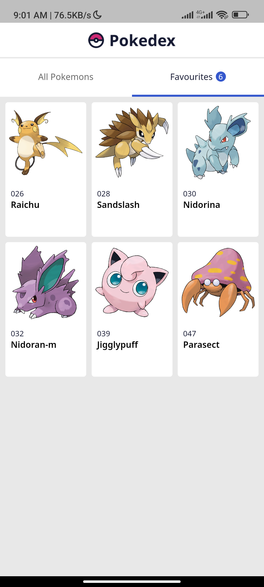
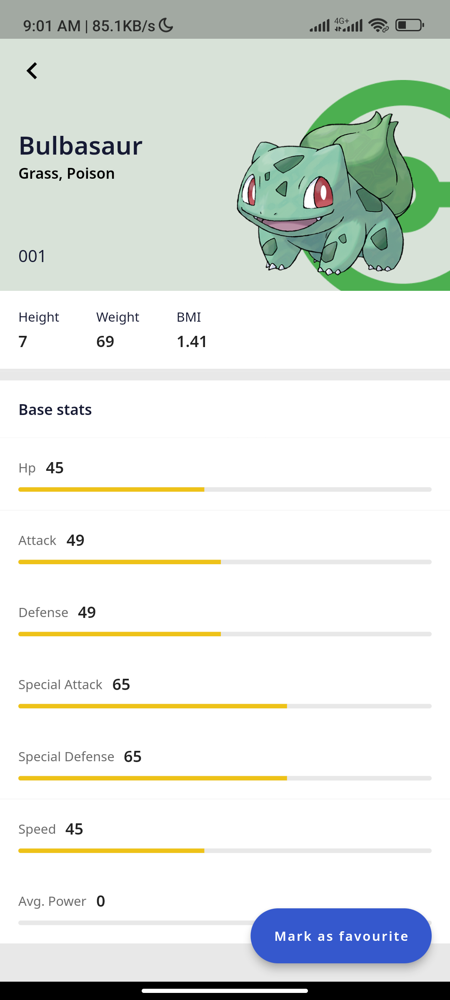
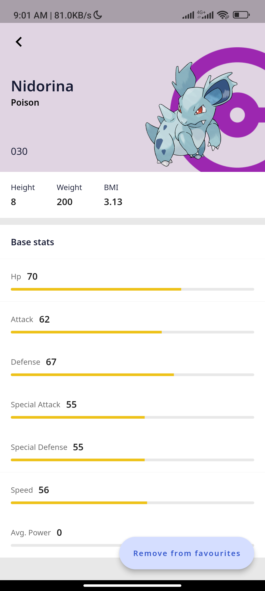

# Pokedex

This application displays Pokemon characters from the [PokeAPI repository](https://pokeapi.co)

## Getting Started

The following tools are required to compile this application

```
Flutter SDK v3.0 and above

Dart SDK v2.16 and above
```

To run this project locally,

- Clone the project
- `cd` into the project's root directory
- Run `flutter run`

## Project Dependencies

### Dependencies

- [dio](https://pub.dev/packages/dio) - HTTP client library

- [flutter_riverpod](https://pub.dev/packages/flutter_riverpod) - State management library


- [hive_flutter](https://pub.dev/packages/hive_flutter) - Key-value data store.

- [json_annotation](https://pub.dev/packages/json_annotation) - Creates code for JSON serialization and deserialization, defines the annotations used by [json_serializable](https://pub.dev/packages/json_serializable)

- [fpdart](https://pub.dev/packages/fpdart) - Functional programming library for Dart

- [mek_data_class](https://pub.dev/packages/mek_data_class) - A data class library for generating `copyWith`, `==`, `hashcode` methods

- [cached_network_image](https://pub.dev/packages/cached_network_image) - A librray to show images from the internet and keep them in the cache directory

### Dev dependencies

- [flutter_lints](https://pub.dev/packages/flutter_lints) - Recommended set of lints for Flutter apps, packages, and plugins.

- [hive_generator](https://pub.dev/packages/hive_generator) - Code generator for [hive](https://pub.dev/packages/hive).

- [json_serializable](https://pub.dev/packages/json_serializable) - Code generator for [json_annotation](https://pub.dev/packages/json_annotation).

- [mek_data_class_generator](https://pub.dev/packages/mek_data_class_generator) - Code generator for [mek_data_class](https://pub.dev/packages/mek_data_class).

- [build_runner](https://pub.dev/packages/build_runner) - Provides a concrete way of generating files using Dart code.

- [flutter_native_splash](https://pub.dev/packages/flutter_native_splash) - Generates iOS, Android, and Web native code for customising splash screens.

- [mocktail](https://pub.dev/packages/mocktail) - Mock library for Dart

- [flutter_gen_runner](https://pub.dev/packages/flutter_gen_runner) - Code generator for assets, colors, and fonts

## Screenshots

<p>
    
    
    
    
    
</p>

<!-- <p>
    
    
</p> -->